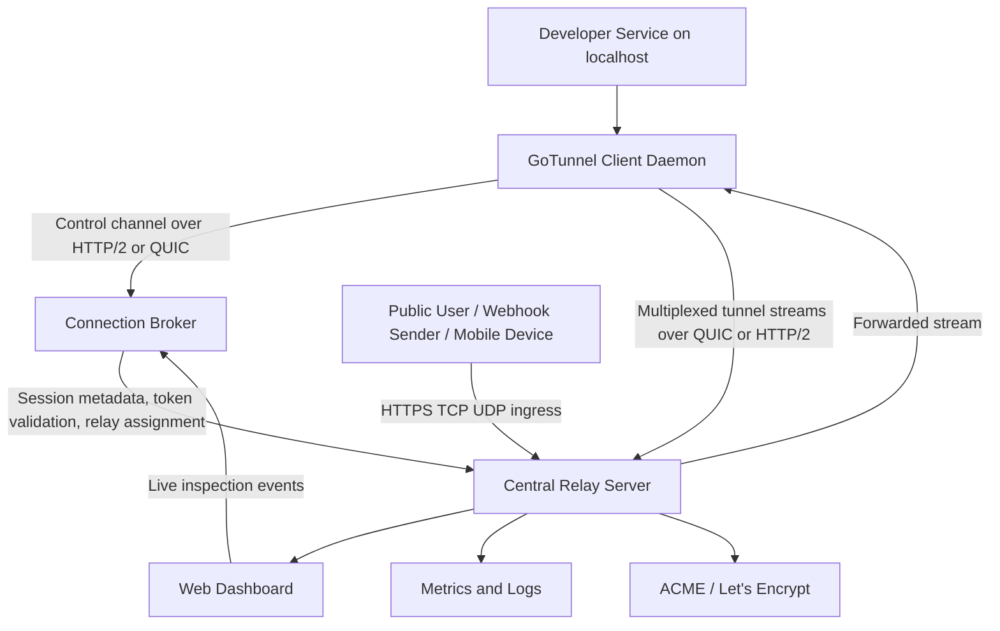

# PRD - GoTunnel

*An open-source, self-hostable, Go-based tunneling platform for developers who need transparent, low-latency, auditable access to local services from the public internet.*

## 1. Project Vision & Goals

### Vision

GoTunnel exists to give developers and small engineering teams a trustworthy alternative to managed tunneling products such as Ngrok. The product must be:

- developer-centric, with fast local-to-public workflows
- self-hostable, with no dependency on a proprietary control plane
- transparent, with clear network behavior, observable internals, and inspectable source code
- production-aware, while still optimized for local development and debugging

### Mission

Build a secure, horizontally scalable tunneling system in Go that allows developers to expose local HTTP, TCP, and UDP services through stable public endpoints with automated HTTPS, rich traffic inspection, and collaborative debugging capabilities.

### Product Goals

1. Deliver tunnel establishment in under 3 seconds for 95% of sessions on healthy networks.
2. Maintain end-to-end tunnel latency below 100 ms at the 99th percentile for same-region traffic.
3. Support at least 10,000 concurrent active tunnels per relay cluster with horizontal scaling.
4. Provide automated HTTPS endpoint provisioning and certificate renewal for 100% of eligible public HTTP tunnels.
5. Achieve 99.9% monthly uptime for the relay control plane and data plane in production deployments.
6. Enable multi-user debugging workflows where at least 5 collaborators can observe the same live tunnel session in real time.
7. Keep self-hosted deployment time under 30 minutes for a standard single-region installation using documented infrastructure automation.

### Non-Goals

GoTunnel is not intended to:

- replace a full API gateway or service mesh
- act as a permanent zero-trust network access suite in v1
- manage container scheduling or application deployment
- provide deep packet inspection for encrypted third-party upstream traffic without explicit termination at the relay

### Success Metrics

- Median tunnel connect time: under 1 second
- Median HTTP request overhead added by relay: under 25 ms in-region
- p99 end-to-end latency: under 100 ms in-region
- Tunnel success rate: above 99.5% for authenticated sessions
- HTTPS issuance success rate: above 98% for valid, properly delegated domains
- Monthly active self-hosted deployments: at least 50 within 6 months of MVP launch

## 2. Core Architecture

### System Overview

GoTunnel is composed of three primary runtime components:

1. `Client Daemon`
   - Runs on the developer machine.
   - Establishes outbound tunnel sessions to the relay.
   - Maintains multiplexed control and data channels.
   - Proxies local HTTP, TCP, or UDP traffic between local services and the remote entrypoint.

2. `Central Relay Server`
   - Exposes public ingress endpoints.
   - Terminates TLS 1.3 for public HTTPS traffic.
   - Routes inbound traffic to the correct client session through multiplexed transport channels.
   - Hosts the web dashboard, ACME automation, metrics, and operator APIs.

3. `Connection Broker`
   - Manages session registration, tunnel metadata, subdomain allocation, token validation, and relay placement.
   - Coordinates tunnel state across relay instances.
   - Assigns tunnels to regional relays and tracks health, lease state, and reconnection policy.

### Concurrency Model

The implementation shall use Go's concurrency model as a first-class architectural constraint:

- Each client session shall run in its own goroutine tree with dedicated cancellation context.
- Separate goroutines shall handle:
  - control-plane heartbeats
  - data-plane stream multiplexing
  - local socket reads and writes
  - replay buffer persistence
  - dashboard event fan-out
- Channels shall be used for:
  - control events such as connect, rekey, reassign, close
  - backpressure signaling between ingress workers and client writers
  - broadcast of inspection events to dashboard subscribers
- Worker pools shall be used on relay nodes for:
  - stream acceptance
  - request logging serialization
  - webhook dispatch
  - certificate job processing

This model is required to keep the system efficient under large tunnel fan-out while preserving clear ownership of session lifecycle and backpressure handling.

### Transport and Protocol Design

GoTunnel shall support two primary transport protocols between the client daemon and relay:

- `HTTP/2`
  - Default transport for control-plane communication and compatibility-first deployments.
  - Used for multiplexed streams where enterprise proxies and standard L7 infrastructure compatibility are more important than lowest possible handshake latency.

- `QUIC`
  - Preferred transport for data-plane communication where supported.
  - Used to reduce head-of-line blocking, improve connection migration behavior, and lower tunnel overhead on lossy networks.

Protocol selection rules:

1. The client attempts QUIC first when enabled and the relay advertises QUIC capability.
2. The client falls back to HTTP/2 over TLS 1.3 if QUIC negotiation fails or is blocked by the network.
3. Control-plane state must remain protocol-agnostic so sessions can migrate between QUIC and HTTP/2 without losing tunnel metadata.
4. A single authenticated client session may multiplex multiple logical tunnel streams over one physical QUIC or HTTP/2 connection.

### Component Interaction Diagram



### Tunnel Lifecycle

1. The client daemon reads YAML configuration or CLI flags.
2. The client authenticates to the connection broker using a token-bound TLS 1.3 session.
3. The broker validates identity, authorizes requested tunnel types, and assigns a relay region.
4. The relay allocates a public endpoint, including subdomain and HTTPS policy when applicable.
5. The client establishes multiplexed data-plane connectivity over QUIC or HTTP/2.
6. The relay publishes tunnel metadata to the dashboard and emits lifecycle events.
7. Inbound traffic is forwarded to the client daemon, which proxies requests to the local target service.
8. Request and session telemetry are streamed to inspection storage and dashboard subscribers.
9. On disconnect, the broker marks the tunnel unhealthy, applies a lease grace period, and coordinates resumption or cleanup.

### Control Plane and Data Plane Separation

- The control plane shall handle authentication, tunnel registration, policy, relay assignment, lifecycle events, and collaboration state.
- The data plane shall handle user traffic forwarding, stream multiplexing, buffering, retry-safe replay capture, and traffic pause/resume actions.
- Control-plane degradation must not drop healthy in-flight data-plane sessions immediately. Existing sessions should remain active for at least 60 seconds during transient broker interruption.

### Security Architecture

#### TLS 1.3 Enforcement

- All client-to-relay and dashboard-to-relay communications shall require TLS 1.3.
- Earlier TLS versions shall be rejected.
- Cipher suites shall be limited to modern AEAD suites supported by the Go standard library and QUIC stack.
- Certificates for public ingress shall be managed automatically for eligible domains.

#### Token-Based Authentication

- Every client daemon shall authenticate using a scoped access token.
- Tokens shall support scopes such as:
  - create tunnel
  - use reserved subdomain
  - inspect traffic
  - replay traffic
  - join collaborative session
  - administer dashboard
- Tokens shall be revocable and rotatable without requiring relay restarts.
- Token verification shall happen in the broker before relay admission and be cached on relays with short TTLs.

#### Authorization Model

- Tunnel ownership shall map to a workspace, user, or service account.
- Reserved subdomains and custom domains shall be authorized against workspace ownership.
- Traffic replay and collaborative pause controls shall require elevated scopes beyond basic tunnel creation.

#### Network Policies

- The broker shall only accept authenticated control-plane traffic from trusted relay and client networks.
- Relay public ingress listeners shall be isolated from broker admin APIs.
- Internal relay-to-broker communication shall run on separate private interfaces or overlay networks.
- Operators deploying in Kubernetes or VM environments shall be able to enforce allowlist-based east-west firewall policies.

#### Secret and Certificate Handling

- Tokens, ACME account keys, and session secrets shall be stored encrypted at rest.
- Relay nodes shall not persist plaintext secrets to logs.
- Certificate private keys shall be generated server-side and stored in encrypted persistent storage or HSM-backed secret stores when available.

## 3. Essential Features

### 3.1 HTTP, TCP, and UDP Tunneling

GoTunnel shall support:

- HTTP and HTTPS tunneling for web applications and webhook endpoints
- raw TCP tunnels for databases, SSH, custom services, and test harnesses
- UDP tunnels for game servers, local discovery-compatible services, and low-latency protocols

Expected behavior:

- Users can declare one or more tunnels per client daemon.
- Each tunnel maps a local address to a remote public endpoint.
- Relay routing shall preserve protocol correctness and connection ordering.
- UDP support shall document packet size limits, idle timeout behavior, and NAT sensitivity.

### 3.2 CLI for Tunnel Lifecycle Management

The CLI shall be the primary operator entrypoint. Required commands:

```text
gotunnel login
gotunnel tunnel create
gotunnel tunnel start
gotunnel tunnel stop
gotunnel tunnel list
gotunnel tunnel inspect
gotunnel tunnel share
gotunnel config validate
gotunnel relay status
```

The CLI shall support:

- interactive login and token-based non-interactive login
- daemon and foreground modes
- machine-readable JSON output for automation
- explicit exit codes for CI and scripts

### 3.3 YAML-Based Configuration

The system shall support a YAML configuration file for repeatable tunnel definitions.

Example high-level shape:

```yaml
version: 1
auth:
  token: env:GOTUNNEL_TOKEN
relay:
  region: ap-south-1
tunnels:
  - name: app-http
    protocol: http
    local_address: 127.0.0.1:3000
    subdomain: myapp
    inspect: true
    https: auto
  - name: postgres
    protocol: tcp
    local_address: 127.0.0.1:5432
```

Configuration shall support:

- environment variable expansion
- per-tunnel overrides
- reserved subdomain requests
- collaboration and webhook settings
- validation before start

### 3.4 Password-Protected Web Dashboard

The dashboard shall provide:

- authenticated access to active tunnels
- real-time request logs and session metadata
- replay controls
- collaboration presence indicators
- endpoint health and certificate status

Authentication model:

- operator login with password plus optional MFA for self-hosted deployments
- session cookies secured with `HttpOnly`, `Secure`, and short idle timeout
- role-based access for viewer, debugger, and admin

### 3.5 Request Inspection and Replay

For HTTP tunnels, GoTunnel shall:

- capture request and response metadata
- persist headers, bodies, timing, source IP, and replay eligibility
- allow replay to the current local service target
- allow replay with modified headers or payload where explicitly enabled

Storage rules:

- default retention for request logs: 24 hours
- configurable retention for self-hosted environments
- body capture limits to prevent unbounded storage growth
- sensitive header redaction by default for `Authorization`, `Cookie`, and user-configured secrets

### 3.6 Configurable Subdomains and Custom Domains

The system shall allow:

- ephemeral subdomains generated automatically
- reserved subdomains under a shared relay domain
- custom domains delegated by the operator or user

Allocation rules:

- ephemeral names shall be random and collision-resistant
- reserved names shall require authorization and uniqueness checks
- custom domains shall require ownership verification and successful DNS validation before public activation

### 3.7 HTTPS URL Generation and Renewal via Let's Encrypt

GoTunnel must automatically generate and renew HTTPS URLs for eligible HTTP tunnels through integrated ACME support.

#### Certificate Workflow

1. A user requests an HTTP tunnel with `https: auto`.
2. The broker allocates either:
   - a relay-managed subdomain under an operator-controlled zone, or
   - a verified custom domain belonging to the user or workspace
3. The relay creates or reuses ACME account credentials.
4. The certificate manager initiates ACME order creation.
5. For relay-managed subdomains, the platform uses `TLS-ALPN-01` or `HTTP-01` validation, depending on deployment topology.
6. For custom domains, the platform prefers `DNS-01` when the operator integrates a supported DNS provider; otherwise it falls back to documented compatible validation methods.
7. The certificate and private key are stored in encrypted persistent storage and loaded onto the ingress relay.
8. Once issuance completes, the relay publishes the final HTTPS URL and starts serving traffic.
9. Renewal begins automatically when a certificate is within 30 days of expiry.
10. Renewal failures trigger retries with exponential backoff, operator alerts, and status updates in the dashboard.

#### Certificate Management Requirements

- Certificates shall renew automatically without requiring tunnel recreation.
- The dashboard shall show issuance state, expiry date, and last renewal attempt.
- Failed issuance shall not silently downgrade a requested secure tunnel.
- If HTTPS issuance fails, the tunnel shall remain in `pending_tls` or `degraded` state with clear operator-visible diagnostics.
- Operators may disable public activation until HTTPS succeeds for security-sensitive deployments.

#### Operational Constraints

- The system shall rate-limit ACME operations to avoid Let's Encrypt throttling.
- Wildcard issuance shall be supported for operator-managed domains when DNS automation exists.
- Certificate storage shall be replicated or rehydrated so that relay failover does not require full re-issuance on every restart.

### 3.8 Webhook Integrations

The platform shall support outbound webhooks for:

- tunnel created
- tunnel stopped
- certificate issued
- certificate renewal failed
- collaborative session started
- tunnel health degraded

Webhook delivery shall include signed payloads and retry logic with dead-letter visibility.

## 4. Innovative Feature: Collaborative Debugging Sessions

### Overview

GoTunnel's differentiating feature is `Collaborative Debugging Sessions`, which allow multiple developers to share one live tunnel session and jointly inspect, annotate, pause, and replay traffic in real time.

This feature addresses a common problem not well served by current tunneling tools: debugging webhook flows, mobile callbacks, QA scenarios, and third-party integrations across distributed teams without sharing raw machine access.

### Primary Use Cases

- A backend developer and QA engineer inspect the same failing webhook requests while reproducing a bug.
- An open-source maintainer invites a contributor to observe callback traffic without exposing a full local environment.
- A support engineer joins a short-lived debugging session to replay a customer-reported request against a patched local build.

### Roles

- `Owner`
  - starts the session
  - controls participant permissions
  - can end the session and transfer ownership

- `Debugger`
  - can view traffic, annotate events, request replay, and set traffic breakpoints if granted

- `Observer`
  - can view real-time logs and comments but cannot pause or replay traffic

### Session Lifecycle

1. The tunnel owner runs `gotunnel tunnel share --name app-http`.
2. The broker creates a collaborative session bound to the active tunnel.
3. The system generates a short-lived invite link or signed access token.
4. Invited participants authenticate through the dashboard or CLI.
5. The dashboard subscribes all approved participants to the same live event stream.
6. Session state persists until manually ended, tunnel termination, or TTL expiry.

### Shared Live State

All participants shall see:

- live request and response metadata
- replay history
- tunnel status and endpoint metadata
- comments and annotations attached to specific requests
- active participant presence and current role

The system shall synchronize state changes to all connected clients within 250 ms in-region for 95% of events.

### Shared Breakpoints on Traffic

Collaborative sessions shall allow authorized users to create traffic breakpoints on:

- URL path match
- HTTP method
- header presence or value
- response status code
- custom tunnel labels

Breakpoint behavior:

- Matching traffic can be paused before forwarding to the local service.
- Paused requests appear in a review queue.
- Authorized participants can:
  - release the request unchanged
  - modify headers or body if mutation is enabled
  - replay later
  - discard the request in non-production debugging contexts

### Real-Time Synchronization

- Dashboard clients shall receive synchronized event streams over WebSocket or Server-Sent Events.
- Comments, breakpoints, replay actions, and pause states shall be broadcast to all session participants.
- Conflict resolution shall use server-assigned event ordering and optimistic UI updates.

### Access Control and Audit

- Sessions shall be private by default.
- Invite links shall be short-lived and revocable.
- Sensitive tunnels may disable sharing entirely through policy.
- All collaborative actions shall be audit-logged, including join, leave, replay, pause, mutation, and role changes.

### Safety Constraints

- Mutation and discard operations shall be disabled by default.
- Production-tagged tunnels shall default to observer-only sharing unless explicitly overridden.
- The owner shall be able to immediately revoke all participants and terminate the session.

## 5. Functional & Non-Functional Requirements

### Functional Requirements

1. The system shall allow authenticated users to create, start, stop, list, and delete tunnels from the CLI.
2. The system shall support HTTP, TCP, and UDP tunnel protocols from the same client daemon.
3. The system shall expose a YAML configuration format that can define multiple tunnels and shared defaults.
4. The system shall allocate ephemeral or reserved subdomains and validate uniqueness before activation.
5. The system shall provision HTTPS endpoints automatically for eligible HTTP tunnels using integrated ACME workflows.
6. The system shall expose a password-protected dashboard with role-based access controls.
7. The system shall capture HTTP request and response metadata for inspection and replay.
8. The system shall redact configured sensitive fields before storing inspection records.
9. The system shall emit signed webhook events for major lifecycle changes.
10. The system shall support collaborative sessions on active tunnels with role-aware permissions.
11. The system shall allow authorized operators to define relay regions and assign tunnels to those regions.
12. The system shall expose metrics and health endpoints for relays, brokers, and certificate workers.
13. The system shall support token rotation without terminating all healthy active sessions immediately.
14. The system shall preserve tunnel ownership, audit records, and certificate metadata across relay restarts.
15. The system shall surface precise status states such as `connecting`, `active`, `pending_tls`, `degraded`, and `disconnected`.

### Non-Functional Requirements

- p99 end-to-end latency for same-region HTTP tunnels shall be below 100 ms under target load.
- Median added relay overhead shall remain below 25 ms for same-region HTTP traffic.
- Tunnel establishment latency shall remain below 3 seconds for 95% of sessions.
- The relay platform shall support at least 10,000 concurrent active tunnels per cluster.
- The control plane and ingress plane shall achieve 99.9% monthly uptime in production deployments.
- Horizontal scaling shall support multiple regions with stateless relays and replicated tunnel metadata.
- The system shall recover from single relay node failure with tunnel reassignment or reconnect initiation within 30 seconds for 95% of impacted sessions.
- Metrics, logs, and traces shall be exportable to Prometheus and OpenTelemetry-compatible backends.
- Inspection storage shall tolerate process restarts without silent data corruption.
- The platform shall support Linux and macOS clients in MVP, with Windows support scheduled after MVP unless implementation capacity allows earlier delivery.
- Sensitive credentials and private keys shall be encrypted at rest and excluded from plaintext logs.
- Public ingress and dashboard authentication flows shall enforce TLS 1.3.

## 6. Target User Personas

### Full-Stack Developer

**Profile**

A developer building web applications with local frontend and backend services who needs stable public URLs for webhooks, OAuth callbacks, demos, and mobile testing.

**Goals**

- expose local services quickly
- get stable HTTPS URLs
- debug inbound requests without leaving the terminal
- avoid vendor lock-in

**Pain Points with Existing Tools**

- opaque relay behavior and limited visibility into transport issues
- paid plans required for useful reserved domains or collaboration
- friction when moving from personal development to self-hosted team usage

**How GoTunnel Helps**

- self-hosted relay and transparent architecture reduce trust concerns
- automatic HTTPS and reserved subdomains reduce setup friction
- built-in inspection and replay improve debugging speed
- collaborative sessions let teammates join without screen sharing

### QA Engineer

**Profile**

A tester validating callbacks, mobile app flows, and external integrations across staging-like local environments.

**Goals**

- reproduce webhook and callback issues reliably
- observe requests in real time
- share tunnel visibility with developers
- pause or replay traffic during test runs

**Pain Points with Existing Tools**

- tunnels are often owned by one developer and hard to share safely
- reproducing bugs requires screen sharing or log copying
- limited control over traffic replay and coordination

**How GoTunnel Helps**

- collaborative debugging sessions provide shared live visibility
- request replay and traffic breakpoints improve test reproducibility
- role-based dashboard access keeps QA involved without over-privileging

### Open-Source Maintainer

**Profile**

A maintainer operating demos, reproducing bug reports, and supporting contributors across many environments with limited budget.

**Goals**

- run a self-hosted relay on modest infrastructure
- provide temporary public endpoints for reproductions
- keep infrastructure observable and cost-efficient
- enable contributors to inspect behavior without exposing full infra access

**Pain Points with Existing Tools**

- per-seat or per-feature pricing makes collaboration expensive
- closed-source behavior makes debugging and trust harder
- limited deployment control for community-run infrastructure

**How GoTunnel Helps**

- open-source implementation and Terraform-friendly deployment fit community workflows
- Go runtime keeps relay footprint efficient
- scoped access tokens and session sharing support contributors safely

## 7. Technical Stack Justification

### Language and Runtime

- `Go`
  - Chosen for efficient concurrency, mature networking primitives, small deployment footprint, and straightforward cross-platform builds.
  - Goroutines and channels map directly to tunnel sessions, event distribution, and connection multiplexing workloads.
  - Strong standard library support reduces dependency surface for critical networking paths.

### Core Networking Libraries

- `quic-go`
  - Required for QUIC transport and low-latency multiplexed streams.
  - Mature Go implementation with active ecosystem usage.
  - Tradeoff: introduces operational complexity compared to pure TCP/TLS, but the latency and head-of-line blocking benefits are material for tunnel performance.

- Go `net/http` and `x/net/http2`
  - Appropriate for HTTP/2 control-plane and compatibility-first data transport.
  - Tradeoff: HTTP/2 is easier to deploy through traditional infrastructure but less resilient than QUIC on lossy networks.

### TLS and Certificate Automation

- `golang.org/x/crypto/acme/autocert` or a comparable ACME manager
  - Suitable for automated Let's Encrypt workflows in early releases.
  - Fastest route to integrated issuance and renewal for relay-managed domains.
  - Tradeoff: complex DNS-provider-specific automation may require extending beyond `autocert` for robust `DNS-01` support in later phases.

- Go standard library TLS stack
  - Appropriate for TLS 1.3 enforcement, certificate reload, and secure defaults without introducing unnecessary cryptographic dependencies.

### CLI and Configuration

- `spf13/cobra`
  - Well-suited for a structured CLI with subcommands, shell completion, and long-term maintainability.

- `spf13/viper` or strict YAML parsing with `gopkg.in/yaml.v3`
  - Supports layered configuration and environment expansion.
  - Tradeoff: Viper offers convenience but can obscure precedence; a stricter YAML-first approach may be preferable if determinism outweighs convenience.

### Dashboard and API Layer

- Go HTTP server with server-rendered pages or a minimal SPA frontend
  - Keeps the operational surface small for self-hosted users.
  - WebSocket or SSE support is required for synchronized collaborative sessions.

### Persistence and Coordination

- `PostgreSQL`
  - Recommended for tunnel metadata, audit records, reserved domains, collaborative session state, and certificate metadata.
  - Reliable transactional semantics fit control-plane coordination.

- `Redis`
  - Recommended for ephemeral session cache, short-lived token caches, relay presence, and pub/sub fan-out.
  - Tradeoff: not a source of truth for durable metadata.

### Observability and Infrastructure

- `Prometheus`
  - Required for metrics collection and alerting in self-hosted environments.

- `OpenTelemetry`
  - Required for distributed tracing across broker, relay, dashboard, and certificate workflows.

- `Terraform`
  - Recommended for declarative provisioning of relay servers, load balancers, DNS records, certificates, and secret stores.

- `Docker` and `Kubernetes`
  - Docker images simplify local and VM deployment.
  - Kubernetes becomes valuable for multi-region scaling, stateless relay rollout, secret rotation, and autoscaling in later phases.

## 8. High-Level Implementation Roadmap

### Phase 1: MVP

**Objective**

Ship a usable self-hosted tunneling platform with core CLI, relay, broker, HTTP and TCP tunnels, and basic HTTPS automation.

**Deliverables**

- client daemon with login, tunnel create, start, stop, and list
- relay ingress for HTTP and TCP
- broker for authentication, tunnel registration, and relay assignment
- YAML configuration parsing
- ephemeral and reserved subdomains
- Let's Encrypt support for relay-managed domains
- basic request inspection for HTTP tunnels
- Prometheus metrics and structured logs

**Milestones**

1. Core session establishment over HTTP/2
2. Relay ingress and HTTP forwarding
3. Token authentication and broker integration
4. HTTPS issuance and renewal for managed subdomains
5. Alpha self-hosted deployment guide

**Success Metrics**

- 100 active users within first launch cohort
- median latency under 50 ms in-region
- p99 latency under 100 ms in-region
- 95% tunnel establishment under 3 seconds
- HTTPS issuance success above 95% for managed domains

### Phase 2: Inspection and Collaboration

**Objective**

Expand GoTunnel from a tunnel utility into a debugging platform with richer inspection, dashboard workflows, and collaborative sessions.

**Deliverables**

- password-protected dashboard with RBAC
- replay with configurable mutation controls
- webhook integrations
- collaborative debugging sessions
- shared annotations and live participant presence
- traffic breakpoints and pause/release workflow
- QUIC transport support for preferred data-plane paths

**Milestones**

1. Dashboard authentication and live event stream
2. Request replay and redaction policy support
3. Collaborative session lifecycle and invitations
4. Shared breakpoints and audit logging
5. QUIC transport rollout behind feature flag

**Success Metrics**

- 500 active users
- at least 30% of active teams use request inspection weekly
- collaborative session join latency under 2 seconds
- synchronized event propagation under 250 ms for 95% of updates in-region
- replay success rate above 98% for eligible requests

### Phase 3: Plugin System and Enterprise-Grade Scale

**Objective**

Support extensibility, multi-region scale, and advanced operator controls for larger organizations and community-hosted deployments.

**Deliverables**

- plugin system for auth providers, webhook sinks, and DNS integrations
- multi-region relay assignment and failover
- custom domain automation for more DNS providers
- HA deployment reference architecture
- policy controls for sharing, retention, and production safeguards
- SSO and advanced audit exports for enterprise deployments

**Milestones**

1. Plugin interface specification and SDK
2. Multi-region routing and replicated control-plane state
3. Custom domain DNS automation expansion
4. Enterprise policy controls and compliance-oriented audit export
5. GA reference deployment for Kubernetes and VM-based installs

**Success Metrics**

- 99.9% monthly uptime across multi-region production reference deployments
- support for 10,000 concurrent active tunnels per cluster
- relay failover recovery under 30 seconds for 95% of affected sessions
- at least 3 production-ready plugins maintained by the project
- at least 10 self-hosted organizations running multi-user deployments

## Acceptance Criteria

The GoTunnel PRD is complete when:

- all eight requested sections are present
- architecture and security decisions are specific enough to guide implementation
- HTTPS certificate automation is fully described with failure handling
- the innovative feature is differentiated and operationally defined
- requirements are measurable and testable
- roadmap phases have clear deliverables and success metrics
