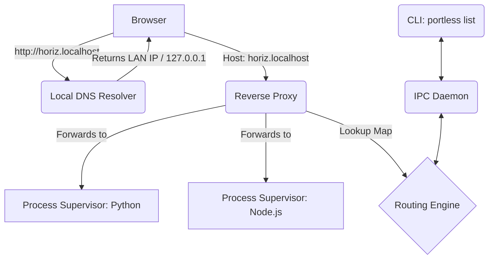

# Architecture Overview

This document provides a deep dive into the architecture of **Portless Dev Router**. If you're contributing to or hacking on the codebase, this is the best place to start.

## High-Level Architecture

Portless replaces the friction of manually tracking ports with clean domains. To achieve this, it combines five distinct systems into one concurrent binary:

## 1. Port Manager (`internal/portman`)

The Port Manager is responsible for assigning free ports dynamically to starting services.

- Instead of parsing `netstat`, Portless takes advantage of the operating system's kernel assignment. 
- It opens a strict TCP connection on `127.0.0.1:0`. The `0` indicates the OS should automatically assign a free, safe port.
- Portless records that port, instantly closes the listener, and reserves the port for the backend application.
- *Fallback Mechanism*: If Port 0 assignment behaves weirdly, it provides a fallback loop that manually scans the `40000-50000` block.

## 2. Process Supervisor (`internal/process`)

When Portless starts a service, it's acting as a micro-process manager.

1. Portless triggers an `exec.Command("sh", "-c", "your command")`.
2. It aggressively injects the OS-assigned port using the underlying `os.Environ()` appended with `PORT=<Assigned_Port>`.
3. It captures `stdout` and `stderr` streams, prefixes them with `[service_name]`, and streams them to the user's terminal synchronously.
4. It sets up signals channels (`os.Signal`) to catch `SIGINT/SIGTERM` locally. It passes these shutdowns cleanly directly to its wrapped processes to prevent zombie Node or Python loops.

## 3. Reverse Proxy (`internal/proxy`)

The Proxy engine runs either on `Port 80` (privileged) or `Port 8080` (unprivileged).

It uses standard Go `net/http/httputil.NewSingleHostReverseProxy`. 
When a request comes in:
1. It analyzes the incoming `Host` header (e.g., `yuki.backend.internal`).
2. It passes that header to the thread-safe `Routing Engine`.
3. If a match occurs, the Director rewrites the URL to target the correct local port (e.g., `127.0.0.1:40123`).

## 4. Local DNS Resolver (`internal/dns`)

This prevents developers from modifying `/etc/hosts` linearly and manually. Instead:
- We embedded `miekg/dns` which starts up a lightweight UDP Listener on `0.0.0.0:53` (standard DNS port), binding securely across the host network interfaces.
- The listener has a single catch-all wildcard rule: if a request ends in `.internal` or `.localhost`, dynamically return the host machine's Local Area Network IP (e.g. `192.168.1.15`).
- By running on `0.0.0.0`, teammates or mobile phones connected to the same Wi-Fi can set their DNS to your IP and cleanly access your local dev environment without any configuration.
- When the developer configures `systemd-resolved` or `dnsmasq` to forward `*.localhost` queries to `127.0.0.1:53`, the host OS treats internal domains as locatable.

## 5. IPC Daemon & CLI (`internal/daemon` & `cli`)

Developers shouldn't have to restart the Proxy or DNS server just to spin up a new frontend dynamically. 

- `portless start`: Initiates all the above modules, but also generates a local Unix socket (`/tmp/portless.sock`) or an internal HTTP server that serves as the IPC (Inter-Process Communication) hub.
- When a user runs `portless add X` in a *separate terminal*, it routes via `cobra` to find the active IPC connection, transmits a `POST /services/add` JSON request.
- The IPC Server reads this, spins up the new process via the Supervisor, assigns a Port via `portman`, lock the variables, and updates the Reverse Proxy gracefully.
